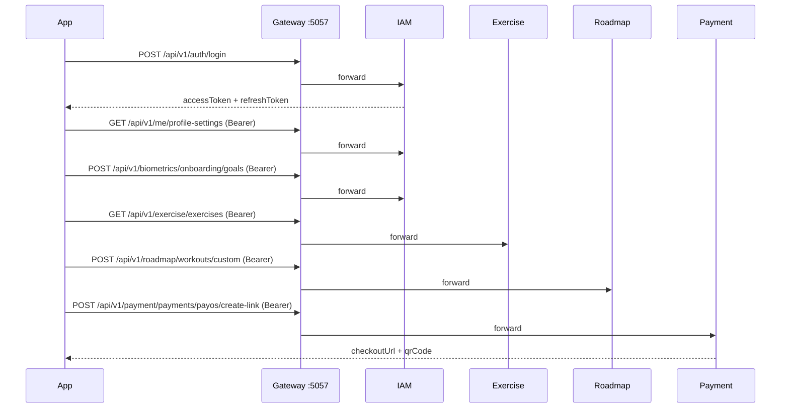

# Sync Platform — API Reference

Tài liệu các API đã expose từ **IAM**, **Payment**, **Roadmap**, **Exercise** (và routing qua **Gateway**).

> **Cập nhật:** sinh từ source controllers/DTOs trong repo. Swagger: mỗi service có `/swagger` khi chạy Development.

---

## Base URLs

| Service | Direct (dev) | Swagger |
|---------|--------------|---------|
| **Gateway** (khuyên dùng cho client) | `http://localhost:5057` | `/swagger` (Development) |
| IAM | `http://localhost:5288` | `/swagger` |
| Payment | `http://localhost:5084` | `/swagger` |
| Roadmap | `http://localhost:5118` | `/swagger` |
| Exercise | `http://localhost:5187` | `/swagger` |

### Health (tất cả service)

```http
GET /health
```

**Response** `200`:

```json
"Healthy"
```

---

## Gateway routing (YARP)

Client **luôn** gọi qua Gateway (`http://localhost:5057`). Hai loại route:

1. **Passthrough** — path Gateway = path service (IAM auth / me / biometrics).
2. **Prefix rewrite** — bỏ prefix service, giữ `/api/v1/...` phía downstream.

| Gateway path | Rewrite? | Service | Path trên service |
|--------------|----------|---------|-------------------|
| `/api/v1/auth/{**}` | Không | IAM `:5288` | `/api/v1/auth/{**}` |
| `/api/v1/me/{**}` | Không | IAM | `/api/v1/me/{**}` |
| `/api/v1/biometrics/{**}` | Không | IAM | `/api/v1/biometrics/{**}` |
| `/api/v1/payment/{**}` | Có → `/api/v1/{**}` | Payment `:5084` | `/api/v1/payments/...` |
| `/api/v1/roadmap/{**}` | Có → `/api/v1/{**}` | Roadmap `:5118` | `/api/v1/sessions/...` |
| `/api/v1/exercise/{**}` | Có → `/api/v1/{**}` | Exercise `:5187` | `/api/v1/exercises/...` |
| `/api/v1/notification/{**}` | Có → `/api/v1/{**}` | Notification `:5106` | `/api/v1/notifications/...` |

**Ví dụ:**

| Gọi qua Gateway | Tương đương trực tiếp |
|-----------------|----------------------|
| `POST http://localhost:5057/api/v1/auth/login` | `POST http://localhost:5288/api/v1/auth/login` |
| `GET http://localhost:5057/api/v1/me/profile-settings` | `GET http://localhost:5288/api/v1/me/profile-settings` |
| `POST http://localhost:5057/api/v1/biometrics/onboarding/basic` | `POST http://localhost:5288/api/v1/biometrics/onboarding/basic` |
| `GET http://localhost:5057/api/v1/exercise/exercises` | `GET http://localhost:5187/api/v1/exercises` |
| `POST http://localhost:5057/api/v1/roadmap/sessions/schedule` | `POST http://localhost:5118/api/v1/sessions/schedule` |
| `POST http://localhost:5057/api/v1/payment/payments/payos/create-link` | `POST http://localhost:5084/api/v1/payments/payos/create-link` |
| `GET http://localhost:5057/api/v1/notification/notifications/user/{userId}` | `GET http://localhost:5106/api/v1/notifications/user/{userId}` |

### JWT qua Gateway

Các route Gateway gắn `AuthorizationPolicy: AuthenticatedUser` (trừ auth công khai và PayOS webhook):

```http
Authorization: Bearer <access_token>
```

Route **không** cần JWT trên Gateway:

- `/api/v1/auth/register`, `login`, `google`, `refresh`, `verify-email`
- `/api/v1/payment/payments/payos/webhook` (PayOS gọi vào)

Gateway cũng inject header nội bộ sau khi validate JWT (`X-User-Id`, `X-User-Email`, `X-User-Role`, `X-Request-Id`). Downstream **vẫn** phải authorize qua `Authorization: Bearer` — không tin header này cho phân quyền.

---

## Envelope chung

### `ApiResponse<T>` (IAM, Payment, Roadmap, Exercise)

**Thành công:**

```json
{
  "success": true,
  "message": "Operation completed successfully.",
  "data": { },
  "errors": null
}
```

**Lỗi** (qua `GlobalExceptionHandler`):

```json
{
  "success": false,
  "message": "Human-readable error message.",
  "data": null,
  "errors": null
}
```

### `PagedApiResponse<T>` (Exercise — danh sách có phân trang)

```json
{
  "success": true,
  "message": "Exercises retrieved successfully.",
  "data": [ ],
  "pagination": {
    "pageNumber": 1,
    "pageSize": 20,
    "totalRecords": 42,
    "totalPages": 3,
    "hasPreviousPage": false,
    "hasNextPage": true
  },
  "errors": null
}
```

### Validation lỗi (400)

Khi model binding/validation fail (`ApiBehaviorOptions`):

```json
{
  "success": false,
  "message": "Validation failed.",
  "data": null,
  "errors": {
    "Email": ["The Email field is required."]
  }
}
```

---

## Enums thường dùng

### `DevicePlatform` (IAM)

| Value | Name |
|-------|------|
| 0 | `IOS` |
| 1 | `Android` |
| 2 | `Web` |

### `BillingCycle` (Payment)

| Value | Name |
|-------|------|
| 0 | `Monthly` |
| 1 | `Yearly` |

### `WebhookProcessOutcome` (Payment)

| Value | Name |
|-------|------|
| 0 | `Processed` |
| 1 | `AlreadyProcessed` |
| 2 | `TransactionNotFound` |
| 3 | `TransactionAlreadyFinal` |
| 4 | `PaymentFailed` |

### Shared (`Libs.Shared.Enums`)

**`ExerciseCategory`:** `Strength`, `Cardio`, `Flexibility`, `Mobility`  
**`Difficulty`:** `Beginner`, `Intermediate`, `Advanced`  
**`MovementPattern`:** `HorizontalPush`, `HorizontalPull`, `VerticalPush`, `VerticalPull`, `Squat`, `Hinge`, `Core`  
**`BodyRegion`:** `UpperBody`, `LowerBody`, `FullBody`, `Core`  
**`AssetType`:** `Unity3D`, `Video`, `Image`  
**`SessionStatus`:** `Scheduled`, `Completed`, `Skipped`, `InProgress`  
**`Visibility`:** `Public`, `Private`

> JSON serialization: các service bật `JsonStringEnumConverter` — enum có thể gửi/nhận dạng **chuỗi** (vd. `"Beginner"`) hoặc số tùy client.

---

# 1. IAM API

| Nhóm | Base path | Auth |
|------|-----------|------|
| Auth | `/api/v1/auth` | Public (trừ `logout`) |
| Me (profile settings) | `/api/v1/me` | Bearer JWT |
| Biometrics (onboarding) | `/api/v1/biometrics` | Bearer JWT |

**Qua Gateway:** dùng cùng path (`/api/v1/auth`, `/api/v1/me`, `/api/v1/biometrics`) — không có prefix `/iam`.

---

## 1.1 Register

```http
POST /api/v1/auth/register
Content-Type: application/json
```

**Request:**

```json
{
  "email": "user@example.com",
  "password": "SecurePass1!",
  "fullName": "Nguyen Van A",
  "deviceId": "device-uuid-or-install-id",
  "platform": "Android"
}
```

**Response** `201`:

```json
{
  "success": true,
  "message": "Registration successful.",
  "data": {
    "userId": "3fa85f64-5717-4562-b3fc-2c963f66afa6",
    "email": "user@example.com",
    "message": "Registration successful. Please check your email to verify your account."
  },
  "errors": null
}
```

**Lỗi:** `400` validation, `409` email đã tồn tại.

---

## 1.2 Verify email

```http
GET /api/v1/auth/verify-email?token=<verification_token>
```

- Trình duyệt (mặc định): `200` + HTML.
- Client JSON: header `Accept: application/json`.

**Response** `200` (JSON):

```json
{
  "success": true,
  "message": "Email verified successfully.",
  "data": {
    "userId": "3fa85f64-5717-4562-b3fc-2c963f66afa6",
    "email": "user@example.com",
    "emailVerified": true
  },
  "errors": null
}
```

**Lỗi:** `400` token không hợp lệ/hết hạn, `404` không tìm thấy user/token.

---

## 1.3 Login

```http
POST /api/v1/auth/login
Content-Type: application/json
```

**Request:**

```json
{
  "email": "user@example.com",
  "password": "SecurePass1!",
  "deviceId": "device-uuid-or-install-id",
  "platform": "Web"
}
```

**Response** `200`:

```json
{
  "success": true,
  "message": "Login successful.",
  "data": {
    "userId": "3fa85f64-5717-4562-b3fc-2c963f66afa6",
    "email": "user@example.com",
    "fullName": "Nguyen Van A",
    "accessToken": "eyJhbGciOiJIUzI1NiIs...",
    "refreshToken": "base64-or-opaque-refresh-token",
    "expiresIn": 3600
  },
  "errors": null
}
```

**Lỗi:** `401` sai mật khẩu, `403` email chưa verify / tài khoản bị khóa.

---

## 1.4 Google sign-in

```http
POST /api/v1/auth/google
Content-Type: application/json
```

**Request:**

```json
{
  "idToken": "<google-id-token-from-flutter-sdk>",
  "deviceId": "device-uuid-or-install-id",
  "platform": "Android"
}
```

**Response** `200`: cùng cấu trúc `AuthResponse` như login.

**Lỗi:** `400` thiếu token, `401` Google ID token không hợp lệ (sai `aud`/chữ ký).

> Backend chấp nhận nhiều Google Client ID (`GoogleAuth:ClientIds` — Web, Android, iOS).

---

## 1.5 Refresh token

```http
POST /api/v1/auth/refresh
Content-Type: application/json
```

**Request:**

```json
{
  "refreshToken": "opaque-refresh-token",
  "deviceId": "device-uuid-or-install-id"
}
```

**Response** `200`: cùng `AuthResponse` như login.

**Lỗi:** `401` refresh token không hợp lệ / hết hạn / device không khớp.

---

## 1.6 Logout

```http
POST /api/v1/auth/logout
Authorization: Bearer <access_token>
Content-Type: application/json
```

**Request:**

```json
{
  "deviceId": "device-uuid-or-install-id"
}
```

**Response** `200`:

```json
{
  "success": true,
  "message": "Logged out successfully.",
  "data": null,
  "errors": null
}
```

**Lỗi:** `401` thiếu/sai JWT.

---

## 1.7 Me — Profile settings & inventory

**Auth:** `Authorization: Bearer` (mọi endpoint). User lấy từ JWT — không gửi `userId` trên URL.

### Get profile settings

```http
GET /api/v1/me/profile-settings
Authorization: Bearer <access_token>
```

**Response** `200`:

```json
{
  "success": true,
  "message": "Profile settings retrieved successfully.",
  "data": {
    "userId": "3fa85f64-5717-4562-b3fc-2c963f66afa6",
    "basic": {
      "fullName": "Nguyen Van A",
      "avatarUrl": null,
      "email": "user@example.com",
      "phoneNumber": null,
      "preferredLanguage": "vi",
      "timeZone": "Asia/Ho_Chi_Minh",
      "role": "User",
      "status": "Active",
      "subscriptionTier": "Free",
      "emailVerified": true,
      "phoneVerified": false
    },
    "fitness": {
      "isConfigured": true,
      "gender": "Male",
      "dateOfBirth": "1995-06-15",
      "heightCm": 175,
      "currentWeightKg": 72,
      "targetWeightKg": 68,
      "fitnessGoal": "LoseFat",
      "activityLevel": "ModeratelyActive",
      "baseTDEE": 2400,
      "bmr": 1650,
      "dailyProteinTargetGram": 158,
      "dailyCarbTargetGram": 220,
      "dailyFatTargetGram": 67,
      "injuries": [],
      "medications": []
    },
    "preferences": {
      "isConfigured": true,
      "allergies": [],
      "favoriteFoods": ["Chicken"],
      "dislikedFoods": [],
      "agentPersona": "FriendlyBuddy",
      "motivationStyle": "Supportive",
      "autoOrderEnabled": false,
      "dataSharingConsent": false,
      "marketingConsent": false
    },
    "profileCompletenessPercent": 85,
    "missingProfileHints": []
  },
  "errors": null
}
```

### Get inventory (gamification, vouchers, achievements)

```http
GET /api/v1/me/inventory
Authorization: Bearer <access_token>
```

**Response** `200`: `InventoryResponse` (gamification summary + vouchers + achievements).

### Update basic profile

```http
PUT /api/v1/me/basic-profile
Authorization: Bearer <access_token>
Content-Type: application/json
```

**Request:**

```json
{
  "fullName": "Nguyen Van A",
  "avatarUrl": "https://cdn.example.com/avatar.jpg",
  "preferredLanguage": "vi",
  "timeZone": "Asia/Ho_Chi_Minh"
}
```

**Response** `200`: `ProfileSettingsResponse` (cùng cấu trúc GET profile-settings).

### Update fitness profile

```http
PUT /api/v1/me/fitness-profile
Authorization: Bearer <access_token>
Content-Type: application/json
```

**Request** (partial update — chỉ gửi field cần đổi):

```json
{
  "currentWeightKg": 71,
  "activityLevel": "VeryActive",
  "fitnessGoal": "LoseFat"
}
```

> Khi đổi cân nặng / mục tiêu / activity level (và đủ dữ liệu tối thiểu), server **tự tính lại** BMR, TDEE và macro (`BiometricTargetCalculator`).

**Response** `200`: `ProfileSettingsResponse`.

### Update account preferences

```http
PUT /api/v1/me/account-preferences
Authorization: Bearer <access_token>
Content-Type: application/json
```

**Request:**

```json
{
  "allergies": [
    { "allergenName": "Peanuts", "severity": "High", "notes": null }
  ],
  "agentPersona": "StrictCoach",
  "autoOrderEnabled": true,
  "maxAutoOrderLimitDaily": 500000,
  "maxAutoOrderLimitPerOrder": 150000,
  "dataSharingConsent": true,
  "marketingConsent": false
}
```

**Lỗi:** `400` validation (vd. bật auto-order nhưng thiếu limit).

**Qua Gateway:** `GET http://localhost:5057/api/v1/me/profile-settings`

---

## 1.8 Biometrics — Onboarding wizard

**Auth:** Bearer JWT. Flow từng bước cho mobile onboarding (khác `PUT /me/fitness-profile` dùng cho settings sau đăng nhập).

### Get biometric profile

```http
GET /api/v1/biometrics
Authorization: Bearer <access_token>
```

**Response** `200`: `BiometricProfileDto` (enum dạng chuỗi trong JSON).

**Lỗi:** `404` chưa khởi tạo profile.

### Onboarding step 1 — Basic

```http
POST /api/v1/biometrics/onboarding/basic
Authorization: Bearer <access_token>
Content-Type: application/json
```

**Request:**

```json
{
  "gender": "Male",
  "dateOfBirth": "1995-06-15",
  "heightCm": 175
}
```

### Onboarding step 2 — Goals (tính BMR/TDEE/macros)

```http
POST /api/v1/biometrics/onboarding/goals
Authorization: Bearer <access_token>
Content-Type: application/json
```

**Request:**

```json
{
  "currentWeightKg": 72,
  "targetWeightKg": 68,
  "fitnessGoal": "LoseFat",
  "activityLevel": "ModeratelyActive",
  "fitnessExperienceLevel": "Intermediate",
  "workoutLocationPreference": "Gym"
}
```

### Onboarding step 3 — Body composition

```http
POST /api/v1/biometrics/onboarding/composition
Authorization: Bearer <access_token>
Content-Type: application/json
```

**Request:**

```json
{
  "currentBodyFatPercentage": 22,
  "goalBodyFatPercentage": 15,
  "muscleMassKg": 32
}
```

### Onboarding step 4 — Safeguards

```http
POST /api/v1/biometrics/onboarding/safeguards
Authorization: Bearer <access_token>
Content-Type: application/json
```

**Request:**

```json
{
  "injuries": ["Lower back"],
  "medications": []
}
```

### Log weight (recalculate targets)

```http
PATCH /api/v1/biometrics/weight
Authorization: Bearer <access_token>
Content-Type: application/json
```

**Request:**

```json
{
  "currentWeightKg": 71
}
```

**Response** `200` (các bước trên): `ApiResponse<BiometricProfileDto>`.

**Lỗi:** `400` chưa hoàn thành bước trước, `404` user/profile không tồn tại.

**Qua Gateway:** `POST http://localhost:5057/api/v1/biometrics/onboarding/basic`

---

# 2. Payment API (PayOS)

**Base path:** `/api/v1/payments/payos`

---

## 2.1 Create payment link

```http
POST /api/v1/payments/payos/create-link
Authorization: Bearer <access_token>
Content-Type: application/json
```

**Request:**

```json
{
  "planId": "3fa85f64-5717-4562-b3fc-2c963f66afa6",
  "billingCycle": "Monthly"
}
```

**Response** `201`:

```json
{
  "success": true,
  "message": "Payment link created.",
  "data": {
    "orderCode": 123456789,
    "transactionId": "3fa85f64-5717-4562-b3fc-2c963f66afa6",
    "amount": 99000,
    "currency": "VND",
    "checkoutUrl": "https://pay.payos.vn/web/...",
    "qrCode": "data:image/png;base64,...",
    "paymentLinkId": "optional-payos-link-id",
    "accountNumber": "optional",
    "bin": "optional",
    "status": "PENDING",
    "expiredAt": 1710000000
  },
  "errors": null
}
```

**Lỗi:** `401`, `404` plan không tồn tại, `502` lỗi PayOS upstream.

**Qua Gateway:**

```http
POST http://localhost:5057/api/v1/payment/payments/payos/create-link
```

---

## 2.2 PayOS webhook

```http
POST /api/v1/payments/payos/webhook
Content-Type: application/json
```

**Auth:** Không (anonymous). Body phải là **raw JSON** đúng định dạng PayOS (SDK verify chữ ký).

**Request** (ví dụ envelope PayOS — tham khảo tài liệu PayOS):

```json
{
  "code": "00",
  "desc": "success",
  "success": true,
  "data": {
    "orderCode": 123456789,
    "amount": 99000,
    "description": "Sync subscription",
    "accountNumber": "...",
    "reference": "...",
    "transactionDateTime": "...",
    "currency": "VND",
    "paymentLinkId": "...",
    "code": "00",
    "desc": "success",
    "counterAccountBankId": null,
    "counterAccountBankName": null,
    "counterAccountName": null,
    "counterAccountNumber": null,
    "virtualAccountName": null,
    "virtualAccountNumber": null
  },
  "signature": "<payos-signature>"
}
```

**Response** `200` (luôn trả OK để PayOS không retry vô hạn):

```json
{
  "success": true,
  "message": "PayOS webhook processed successfully. OrderCode=123456789, UserId=...",
  "data": {
    "outcome": "Processed",
    "orderCode": 123456789,
    "message": "Subscription activated."
  },
  "errors": null
}
```

**Lỗi:** `400` body rỗng/JSON sai, `401` chữ ký webhook sai.

**Qua Gateway (đăng ký URL trên PayOS Dashboard):**

```http
POST http://localhost:5057/api/v1/payment/payments/payos/webhook
```

---

# 3. Roadmap API

**Auth:** Tất cả endpoint yêu cầu `Authorization: Bearer` (`AuthenticatedUser`).  
`userId` trong body **bị ghi đè** từ JWT — không tin giá trị client gửi.

---

## 3.1 Schedule session (AI flow)

```http
POST /api/v1/sessions/schedule
Authorization: Bearer <access_token>
Content-Type: application/json
```

**Request:**

```json
{
  "roadmapId": "3fa85f64-5717-4562-b3fc-2c963f66afa6",
  "scheduledDate": "2026-05-22T09:00:00+07:00",
  "scheduledTime": "09:00",
  "timezone": "Asia/Ho_Chi_Minh",
  "sessionTitle": "Upper body strength",
  "sessionType": "Strength",
  "estimatedDurationMinutes": 45,
  "notificationEnabled": true,
  "notificationMinutesBefore": 30,
  "executionBlocks": [
    {
      "order": 1,
      "exerciseId": "3fa85f64-5717-4562-b3fc-2c963f66afa6",
      "exerciseName": "Bench Press",
      "exerciseAssetId": null,
      "targetSets": 4,
      "targetReps": 10,
      "targetWeightKg": 60.0,
      "restSeconds": 90,
      "tempo": "3010",
      "exerciseNotes": "Control eccentric"
    }
  ]
}
```

> `roadmapId` có thể `null` cho buổi tập tự do (không thuộc roadmap).

**Response** `201`:

```json
{
  "success": true,
  "message": "Session scheduled successfully.",
  "data": {
    "session": {
      "id": "3fa85f64-5717-4562-b3fc-2c963f66afa6",
      "roadmapId": "3fa85f64-5717-4562-b3fc-2c963f66afa6",
      "scheduledDate": "2026-05-22T09:00:00+07:00",
      "scheduledTime": "09:00",
      "timezone": "Asia/Ho_Chi_Minh",
      "sessionType": "Strength",
      "sessionTitle": "Upper body strength",
      "estimatedDurationMinutes": 45,
      "notificationEnabled": true,
      "notificationMinutesBefore": 30,
      "aiGenerated": false,
      "sessionStatus": "Scheduled",
      "executionBlocks": [ ],
      "createdAt": "2026-05-22T02:00:00+00:00"
    },
    "scheduledWorkout": {
      "id": "3fa85f64-5717-4562-b3fc-2c963f66afa6",
      "userId": "3fa85f64-5717-4562-b3fc-2c963f66afa6",
      "sessionId": "3fa85f64-5717-4562-b3fc-2c963f66afa6",
      "scheduledStartTime": "2026-05-22T09:00:00+07:00",
      "scheduledEndTime": "2026-05-22T09:45:00+07:00",
      "status": "Scheduled",
      "repeatPattern": ""
    }
  },
  "errors": null
}
```

**Qua Gateway:** `POST /api/v1/roadmap/sessions/schedule`

---

## 3.2 Schedule from custom workout

```http
POST /api/v1/sessions/from-custom/{customWorkoutId}
Authorization: Bearer <access_token>
Content-Type: application/json
```

**Request:**

```json
{
  "scheduledDate": "2026-05-23T18:00:00+07:00",
  "scheduledTime": "18:00",
  "timezone": "Asia/Ho_Chi_Minh",
  "sessionType": "Strength",
  "estimatedDurationMinutes": 40,
  "notificationEnabled": true,
  "notificationMinutesBefore": 15
}
```

**Response** `201`: cùng `ScheduledSessionResultDto` như 3.1.

**Lỗi:** `404` custom workout không tồn tại.

---

## 3.3 Get session by id

```http
GET /api/v1/sessions/{sessionId}
Authorization: Bearer <access_token>
```

**Response** `200`:

```json
{
  "success": true,
  "message": "Session retrieved successfully.",
  "data": {
    "id": "3fa85f64-5717-4562-b3fc-2c963f66afa6",
    "roadmapId": "3fa85f64-5717-4562-b3fc-2c963f66afa6",
    "scheduledDate": "2026-05-22T09:00:00+07:00",
    "scheduledTime": "09:00",
    "timezone": "Asia/Ho_Chi_Minh",
    "sessionType": "Strength",
    "sessionTitle": "Upper body strength",
    "estimatedDurationMinutes": 45,
    "notificationEnabled": true,
    "notificationMinutesBefore": 30,
    "aiGenerated": false,
    "sessionStatus": "Scheduled",
    "executionBlocks": [ ],
    "createdAt": "2026-05-22T02:00:00+00:00"
  },
  "errors": null
}
```

---

## 3.4 List sessions by roadmap

```http
GET /api/v1/sessions/roadmap/{roadmapId}
Authorization: Bearer <access_token>
```

**Response** `200`:

```json
{
  "success": true,
  "message": "Sessions retrieved successfully.",
  "data": [ ],
  "errors": null
}
```

---

## 3.5 Submit workout execution

```http
POST /api/v1/sessions/{sessionId}/execute
Authorization: Bearer <access_token>
Content-Type: application/json
```

**Request:**

```json
{
  "startedAt": "2026-05-22T09:00:00+07:00",
  "completedAt": "2026-05-22T09:42:00+07:00",
  "perceivedDifficulty": 7,
  "energyLevelBefore": 6,
  "energyLevelAfter": 4,
  "caloriesBurned": 320,
  "sessionFeedback": "Felt strong on compound lifts.",
  "skippedExercises": [],
  "setsPerformed": [
    {
      "exerciseId": "3fa85f64-5717-4562-b3fc-2c963f66afa6",
      "setNumber": 1,
      "targetReps": 10,
      "actualReps": 10,
      "weightKg": 60.0,
      "rir": 2,
      "restTakenSeconds": 90,
      "formScore": 85
    }
  ]
}
```

**Response** `201`:

```json
{
  "success": true,
  "message": "Workout execution logged successfully.",
  "data": {
    "executionLogId": "3fa85f64-5717-4562-b3fc-2c963f66afa6",
    "sessionId": "3fa85f64-5717-4562-b3fc-2c963f66afa6",
    "userId": "3fa85f64-5717-4562-b3fc-2c963f66afa6",
    "startedAt": "2026-05-22T09:00:00+07:00",
    "completedAt": "2026-05-22T09:42:00+07:00",
    "actualDurationMinutes": 42,
    "perceivedDifficulty": 7,
    "energyLevelBefore": 6,
    "energyLevelAfter": 4,
    "caloriesBurned": 320,
    "completionRate": 100,
    "skippedExercises": [],
    "setsPerformed": [ ]
  },
  "errors": null
}
```

**Lỗi:** `409` session đã được execute.

---

## 3.6 Custom workouts

### Create custom workout

```http
POST /api/v1/workouts/custom
Authorization: Bearer <access_token>
Content-Type: application/json
```

**Request:**

```json
{
  "workoutName": "My Push Day",
  "scheduleMode": "Manual",
  "visibility": "Private",
  "allowAiOptimization": true,
  "customBlocks": [
    {
      "exerciseId": "3fa85f64-5717-4562-b3fc-2c963f66afa6",
      "sets": 4,
      "reps": 10,
      "weightKg": 60.0,
      "restSeconds": 90
    }
  ]
}
```

**Response** `201`:

```json
{
  "success": true,
  "message": "Custom workout created successfully.",
  "data": {
    "id": "3fa85f64-5717-4562-b3fc-2c963f66afa6",
    "userId": "3fa85f64-5717-4562-b3fc-2c963f66afa6",
    "workoutName": "My Push Day",
    "visibility": "Private",
    "scheduleMode": "Manual",
    "allowAiOptimization": true,
    "customBlocks": [ ],
    "createdAt": "2026-05-22T02:00:00+00:00"
  },
  "errors": null
}
```

### Get custom workout by id

```http
GET /api/v1/workouts/{id}
Authorization: Bearer <access_token>
```

**Response** `200`: `UserCustomWorkoutDto` như trên.

### List custom workouts by user

```http
GET /api/v1/workouts/user/{userId}
Authorization: Bearer <access_token>
```

**Response** `200`: mảng `UserCustomWorkoutDto`.

**Lỗi:** `403` nếu user không phải admin và `userId` ≠ user trong JWT.

**Qua Gateway:** thay prefix `/api/v1/` → `/api/v1/roadmap/` (vd. `/api/v1/roadmap/workouts/custom`).

---

# 4. Exercise API

**Auth:** `Authorization: Bearer` (`AuthenticatedUser`) — cả khi gọi trực tiếp service hoặc qua Gateway (`/api/v1/exercise/**`).

---

## 4.1 Exercise catalog

### Search (paginated)

```http
GET /api/v1/exercises?query=bench&category=Strength&difficulty=Beginner&pageNumber=1&pageSize=20
```

| Query | Mô tả |
|-------|--------|
| `query` | Tìm theo tên/code |
| `category`, `difficulty`, `bodyRegion`, `movementPattern`, `primaryMuscle`, `equipment` | Lọc |
| `pageNumber`, `pageSize` | Phân trang (mặc định 1, 20) |

**Response** `200`: `PagedApiResponse<ExerciseCatalogDto[]>`.

**Item mẫu:**

```json
{
  "id": "3fa85f64-5717-4562-b3fc-2c963f66afa6",
  "exerciseCode": "BENCH_PRESS",
  "nameEn": "Bench Press",
  "nameVi": "Đẩy ngực",
  "slug": "bench-press",
  "category": "Strength",
  "difficulty": "Intermediate",
  "movementPattern": "HorizontalPush",
  "primaryMuscles": ["Chest"],
  "secondaryMuscles": ["Triceps"],
  "equipmentRequired": ["Barbell"],
  "isCompound": true,
  "bodyRegion": "UpperBody",
  "estimatedCaloriesPerMinute": 8,
  "metValue": 6.0,
  "recommendedRestSeconds": 90,
  "contraindications": [],
  "recommendedGoals": ["Hypertrophy"],
  "movementTags": [],
  "aiCoachingCues": ["Retract scapula"],
  "commonMistakes": [],
  "requiresSpotter": true,
  "isActive": true
}
```

### Get by id

```http
GET /api/v1/exercises/{id}
```

### Get detail (kèm motion assets)

```http
GET /api/v1/exercises/{id}/detail
```

**Response** `200`: `ExerciseCatalogDetailDto` = catalog fields + `motionAssets[]`.

### Get by code / slug

```http
GET /api/v1/exercises/code/{code}
GET /api/v1/exercises/slug/{slug}
```

### Create

```http
POST /api/v1/exercises
Content-Type: application/json
```

**Request** (`CreateExerciseCatalogDto` — không có `id`, `isActive`):

```json
{
  "exerciseCode": "BENCH_PRESS",
  "nameEn": "Bench Press",
  "nameVi": "Đẩy ngực",
  "slug": "bench-press",
  "category": "Strength",
  "difficulty": "Intermediate",
  "movementPattern": "HorizontalPush",
  "primaryMuscles": ["Chest"],
  "secondaryMuscles": ["Triceps"],
  "equipmentRequired": ["Barbell"],
  "isCompound": true,
  "bodyRegion": "UpperBody",
  "estimatedCaloriesPerMinute": 8,
  "metValue": 6.0,
  "recommendedRestSeconds": 90,
  "contraindications": [],
  "recommendedGoals": ["Hypertrophy"],
  "movementTags": [],
  "aiCoachingCues": [],
  "commonMistakes": [],
  "requiresSpotter": true
}
```

**Response** `201`: `ApiResponse<ExerciseCatalogDto>`.

### Update

```http
PUT /api/v1/exercises/{id}
Content-Type: application/json
```

**Request:** `UpdateExerciseCatalogDto` (= create fields + `"isActive": true`).

**Response** `200`: `data: null`, message success.

### Delete

```http
DELETE /api/v1/exercises/{id}
```

**Response** `200`: `data: null`.

---

## 4.2 Motion assets

### List by exercise

```http
GET /api/v1/exercises/{exerciseId}/motion-assets
```

**Response** `200`:

```json
{
  "success": true,
  "message": "Motion assets retrieved successfully.",
  "data": [
    {
      "id": "3fa85f64-5717-4562-b3fc-2c963f66afa6",
      "exerciseId": "3fa85f64-5717-4562-b3fc-2c963f66afa6",
      "assetType": "Video",
      "resourceUrl": "https://cdn.example.com/videos/bench.mp4",
      "thumbnailUrl": "https://cdn.example.com/thumbs/bench.jpg",
      "unityPrefabId": null,
      "unityAnimationClip": null,
      "animationDurationSeconds": 30
    }
  ],
  "errors": null
}
```

### Get by id

```http
GET /api/v1/motion-assets/{id}
```

### Create

```http
POST /api/v1/exercises/{exerciseId}/motion-assets
Content-Type: application/json
```

**Request:**

```json
{
  "exerciseId": "3fa85f64-5717-4562-b3fc-2c963f66afa6",
  "assetType": "Video",
  "resourceUrl": "https://cdn.example.com/videos/bench.mp4",
  "thumbnailUrl": null,
  "unityPrefabId": null,
  "unityAnimationClip": null,
  "animationDurationSeconds": 30
}
```

> `exerciseId` trong body phải khớp `{exerciseId}` trên route.

**Response** `201`: `ExerciseMotionAssetDto`.

### Update / Delete

```http
PUT /api/v1/motion-assets/{id}
DELETE /api/v1/motion-assets/{id}
```

---

## 4.3 Workout templates

### List all (paginated)

```http
GET /api/v1/workout-templates?pageNumber=1&pageSize=20
```

### List system templates

```http
GET /api/v1/workout-templates/system?pageNumber=1&pageSize=20
```

**Response** `200`: `PagedApiResponse<WorkoutTemplateDto[]>`.

**Item mẫu:**

```json
{
  "id": "3fa85f64-5717-4562-b3fc-2c963f66afa6",
  "name": "Push Day A",
  "goal": "Hypertrophy",
  "difficulty": "Intermediate",
  "estimatedDurationMinutes": 50,
  "targetMuscleGroups": ["Chest", "Shoulders"],
  "requiredEquipment": ["Barbell", "Dumbbell"],
  "estimatedCaloriesBurn": 350,
  "aiRecoveryScore": 72,
  "isSystemTemplate": true,
  "createdBy": "system",
  "sessions": [
    {
      "order": 1,
      "exerciseId": "3fa85f64-5717-4562-b3fc-2c963f66afa6",
      "sets": 4,
      "minReps": 8,
      "maxReps": 12,
      "restSeconds": 90,
      "tempo": "3010",
      "rir": 2,
      "notes": null
    }
  ]
}
```

### Get by id

```http
GET /api/v1/workout-templates/{id}
```

### Create

```http
POST /api/v1/workout-templates
Content-Type: application/json
```

**Request:**

```json
{
  "name": "Push Day A",
  "goal": "Hypertrophy",
  "difficulty": "Intermediate",
  "estimatedDurationMinutes": 50,
  "estimatedCaloriesBurn": 350,
  "aiRecoveryScore": 72,
  "isSystemTemplate": false,
  "createdBy": "user@example.com",
  "sessions": [
    {
      "order": 1,
      "exerciseId": "3fa85f64-5717-4562-b3fc-2c963f66afa6",
      "sets": 4,
      "minReps": 8,
      "maxReps": 12,
      "restSeconds": 90,
      "tempo": "3010",
      "rir": 2,
      "notes": null
    }
  ]
}
```

**Response** `201`: `WorkoutTemplateDto`.

### Update / Delete

```http
PUT /api/v1/workout-templates/{id}
DELETE /api/v1/workout-templates/{id}
```

**Qua Gateway:** prefix `/api/v1/exercise/` (vd. `GET /api/v1/exercise/workout-templates`).

---

## HTTP status tóm tắt

| Code | Ý nghĩa chung |
|------|----------------|
| 200 | OK |
| 201 | Created |
| 400 | Validation / bad request |
| 401 | Unauthorized (JWT / Google token / webhook signature) |
| 403 | Forbidden (email chưa verify, quyền custom workout) |
| 404 | Not found |
| 409 | Conflict (email trùng, session đã execute) |
| 500 | Lỗi không mong đợi |
| 502 | Payment — lỗi PayOS upstream |

---

## Luồng gợi ý (client)



---

## Chưa có trong tài liệu này

- **Notification API** — đã route qua Gateway (`/api/v1/notification/**` → `/api/v1/notifications/**`) nhưng chưa mô tả endpoint chi tiết.
- **Marketplace** — chưa implement.

## Convention mã nguồn IAM

- Tất cả DTO nằm trong `Iam.Application/DTOs/` với namespace `Iam.Application.DTOs` (không dùng `Dtos`).

## Cấu hình môi trường (appsettings)

- Git track trực tiếp `appsettings.json` và `appsettings.Development.json` (không dùng `*.example.json`).
- Secret / API key / connection password: key có trong JSON, **giá trị rỗng** `""` trên repo.
- Sau `git pull`: điền giá trị local (hoặc dùng `appsettings.Development.local.json` — gitignored).
- Chi tiết: `core/SyncPlatform/CONFIGURATION.md`.
