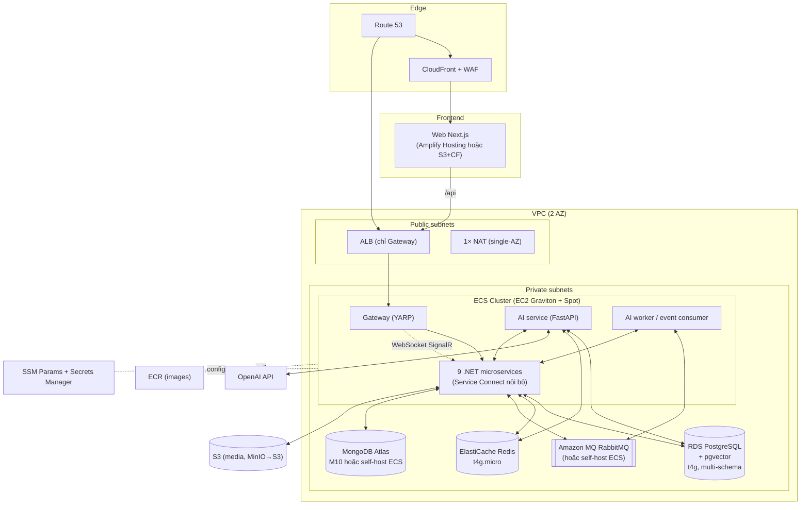
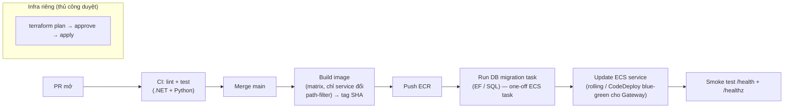
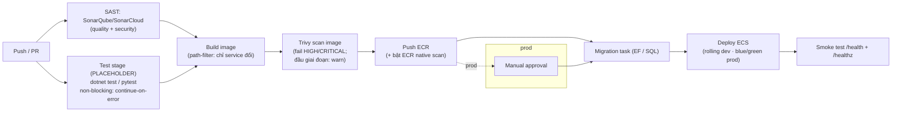

# SYNC — Kiến trúc AWS + CI/CD + Terraform (tối ưu chi phí)

> Thiết kế deploy toàn nền tảng SYNC lên AWS bằng Terraform, ưu tiên **rẻ nhưng chạy tốt** cho giai đoạn early/production nhỏ, có đường nâng cấp khi scale.

---

## 1. Cần deploy những gì (từ source thật)
| Nhóm | Thành phần | Đặc tính |
|------|-----------|----------|
| **Backend .NET 10** | Gateway (YARP, public) + 9 microservices: IAM, Roadmap, Exercise, Nutrition, Marketplace, Order, Payment, Notification, Social | Stateless HTTP; Notification/Nutrition/Order có **SignalR (WebSocket)** |
| **AI service** | `sync-agent-service` (FastAPI, SSE streaming) + **event consumer worker** | Stateless; gọi LLM ngoài (OpenAI) — KHÔNG cần GPU |
| **Data stores** | PostgreSQL (+**pgvector** cho AI), MongoDB, Redis, RabbitMQ, Object storage (MinIO) | Stateful |
| **Frontend** | Web Next.js (khách + admin), Mobile Flutter | Web cần host; Mobile build → store |
| **Nền** | JWT, Internal API Key, OpenAI keys | Secrets |

> Điểm cộng chi phí: AI dùng **API ngoài** → không cần EC2 GPU/Bedrock. pgvector chạy chung trên Postgres → **không tốn vector DB riêng**.

---

## 2. Nguyên tắc tối ưu chi phí (cost levers)
1. **ECS trên EC2 Graviton (ARM t4g), bin-packing** — nhồi ~11 container nhỏ lên **1–2 instance** thay vì 11 task Fargate riêng (rẻ hơn nhiều ở quy mô nhỏ). Worker/non-critical dùng **Spot**.
2. **1 ALB duy nhất** cho Gateway (public); nội bộ dùng **ECS Service Connect / Cloud Map** (miễn phí, không cần ALB cho từng service).
3. **Graviton mọi nơi** (RDS, ElastiCache, EC2) → rẻ ~20%.
4. **1 NAT** (single-AZ) + **VPC Endpoints** (S3/DynamoDB gateway = free; ECR/Logs/Secrets interface) để cắt phí NAT data — NAT là bẫy chi phí lớn nhất.
5. **S3 thay MinIO**; **pgvector chung RDS** (bỏ DB vector riêng).
6. **SSM Parameter Store** cho config (free tier) thay Secrets Manager ở phần không cần xoay vòng.
7. **Right-size + scale sau**: khởi điểm `db.t4g.small`, `cache.t4g.micro`; bật auto-scaling; **tắt/thu nhỏ môi trường dev ban đêm** (scheduled scaling).
8. **KHÔNG dùng EKS** (control plane ~$73/mo) — thừa cho giai đoạn này; ECS quản lý miễn phí.
9. **Savings Plan/Reserved** cho phần baseline sau khi biết traffic ổn định.

---

## 3. Kiến trúc AWS



### Mapping service → AWS
| Thành phần | AWS | Vì sao (rẻ + tốt) |
|-----------|-----|-------------------|
| .NET services + AI + worker | **ECS on EC2 (t4g) + Spot** | Bin-pack nhiều container/instance; Spot cho worker |
| Ingress | **1× ALB** (Gateway) + Cloud Map nội bộ | Chỉ 1 ALB; WebSocket/SSE OK |
| PostgreSQL + pgvector | **RDS PostgreSQL t4g** (Single-AZ đầu, Multi-AZ khi prod) | Managed, pgvector sẵn, gộp DB AI |
| MongoDB | **MongoDB Atlas M10** (hoặc self-host ECS+EBS) | Atlas rẻ & managed hơn DocumentDB |
| Redis | **ElastiCache Redis t4g.micro** | Cache + rate-limit + checkpointer |
| RabbitMQ | **Amazon MQ mq.t3.micro** (hoặc self-host) | Single-broker rẻ; nâng cluster sau |
| Object storage | **S3** (+ CloudFront cho media) | Pay-per-use, bỏ MinIO |
| Web Next.js | **Amplify Hosting** (SSR) hoặc **S3+CloudFront** (static export) | Rẻ, không nuôi server |
| Secrets/config | **SSM Parameter Store** + **Secrets Manager** (DB creds) | Free tier tối đa |
| Images | **ECR** | Private registry |
| DNS/CDN/WAF | **Route 53 + CloudFront + WAF** | Cache + chặn abuse |

---

## 4. CI/CD Pipeline

**Nguồn:** GitHub (đã có `.github/workflows`). **CI = GitHub Actions** (rẻ, sẵn), deploy vào AWS qua **OIDC** (không lưu key dài hạn).



**Chi tiết:**
- **PR:** lint + unit test (.NET `dotnet test`, Python `pytest`), build check. Không deploy.
- **Merge `main`:** build **chỉ service thay đổi** (path filter) → image tag = git SHA → push ECR. Tránh build lại 11 service mỗi lần.
- **Migration:** chạy **one-off ECS task** (EF migrations cho .NET; `migrations/*.sql` cho AI) TRƯỚC khi deploy code mới. Idempotent.
- **Deploy:** cập nhật task definition (image mới) → **rolling update** ECS; riêng Gateway có thể **CodeDeploy blue/green** (zero-downtime). Health check `/health` (.NET) và `/healthz` (AI).
- **Môi trường:** `dev` → `staging` → `prod`; prod cần **manual approval**.
- **Rollback:** ECS giữ task def cũ → rollback = trỏ lại revision trước; blue/green tự rollback khi health fail.
- **Terraform:** workflow riêng, `plan` trên PR (comment diff), `apply` sau approve. Không trộn với deploy app.

---

## 5. Cấu trúc Terraform (module hoá)
```
infra/terraform/
├── backend.tf            # S3 state + DynamoDB lock
├── modules/
│   ├── network/          # VPC, subnets, 1 NAT, VPC endpoints, SG
│   ├── ecs-cluster/      # ECS + EC2 ASG (t4g) + capacity provider (Spot)
│   ├── ecs-service/      # tái dùng: 1 service = task def + service + Service Connect
│   ├── alb/              # ALB + listener + target group (Gateway)
│   ├── rds/              # RDS Postgres (+pgvector param group)
│   ├── redis/            # ElastiCache
│   ├── mq/               # Amazon MQ RabbitMQ
│   ├── s3/               # buckets + CloudFront
│   ├── ecr/              # repos per service
│   ├── secrets/          # SSM params + Secrets Manager
│   └── observability/    # CloudWatch log groups, alarms, dashboards
└── envs/
    ├── dev/  (main.tf gọi modules, biến rẻ: single-AZ, spot nhiều)
    ├── staging/
    └── prod/ (multi-AZ RDS, ít spot cho service critical)
```
- **State:** S3 (versioned, encrypted) + DynamoDB lock. Tách state theo env.
- **`ecs-service` module tái dùng** cho cả 11 service (chỉ đổi biến: tên, port, CPU/mem, public/private, có/không WebSocket).
- Biến hoá theo env: instance size, số AZ, tỉ lệ Spot, Multi-AZ RDS.

---

## 6. Ước tính chi phí (rough, us-east-1/ap-southeast-1, giai đoạn nhỏ)
| Hạng mục | Cấu hình khởi điểm | ~USD/tháng |
|----------|--------------------|-----------|
| ECS EC2 (2× t4g.medium, phần Spot) | Chạy ~11 container | $45–70 |
| ALB | 1 ALB | $18–22 |
| NAT (single) | 1 NAT GW (hoặc NAT instance t4g.nano ~$4) | $32 (hoặc ~$5) |
| RDS Postgres t4g.small (single-AZ) | +pgvector, gồm DB AI | $25–35 |
| ElastiCache t4g.micro | Redis | $12–16 |
| Amazon MQ mq.t3.micro | RabbitMQ single | $15–20 |
| MongoDB Atlas M10 | managed | $57 (hoặc self-host ~$0 thêm) |
| S3 + CloudFront | media/web | $5–15 (theo dùng) |
| Web (Amplify/CloudFront) | Next.js | $5–15 |
| ECR + Logs + SSM | | $5–10 |
| **Tổng ước tính** | **prod nhỏ** | **~$220–290/mo** |

**Cắt thêm nếu cần cực rẻ (dev/MVP):** NAT instance thay NAT GW (−$27), self-host Mongo+RabbitMQ+Redis trên chính ECS EC2 (−$80+), single instance t4g.medium → tổng có thể về **~$90–120/mo**. Đổi lại giảm HA — chấp nhận ở giai đoạn đầu.

> Chi phí LLM (OpenAI) tính riêng theo usage, không nằm trong AWS.

---

## 7. Bảo mật & vận hành
- **IAM least-privilege**; GitHub OIDC role chỉ push ECR + update ECS + đọc/ghi state.
- **Secrets** không vào image/env plaintext → inject từ SSM/Secrets Manager lúc chạy (ECS secrets).
- **Network:** service trong private subnet; chỉ Gateway + ALB public; SG chặt (Gateway↔services, services↔data theo port).
- **DB:** encryption at-rest (KMS), backup tự động (RDS snapshot), Multi-AZ khi prod thật.
- **Quan sát:** CloudWatch Logs (retention ngắn để rẻ, vd 14–30 ngày) + alarm (CPU, 5xx, RDS conn, queue depth); dashboard tổng quan. AI tracing Langfuse self-host trên ECS (tùy chọn).
- **WAF** trước CloudFront/ALB (rate-limit, chặn bot) — bảo vệ endpoint AI/đăng nhập.

---

## 8. Lộ trình triển khai (phased)
| Phase | Việc |
|-------|------|
| **P0** | Terraform: network + ECR + S3 state; đẩy 1 service (IAM) + RDS lên dev → chạy được |
| **P1** | Module `ecs-service` tái dùng cho toàn bộ .NET + AI; ALB + Service Connect; migration task |
| **P2** | GitHub Actions OIDC: build path-filter → ECR → deploy dev; smoke test |
| **P3** | staging + prod (Multi-AZ RDS, blue/green Gateway, WAF, alarms); web (Amplify) |
| **P4** | Tối ưu chi phí: Spot tuning, scheduled scaling dev, Savings Plan; Mongo/MQ managed hoặc self-host chốt |

---

## 9. Quyết định cần chốt trước khi viết TF
1. **Region:** ap-southeast-1 (Singapore, gần VN, latency tốt) — khuyến nghị.
2. **Mongo:** Atlas M10 (managed, +$57) hay self-host trên ECS (rẻ hơn, tự lo backup)?
3. **RabbitMQ/Redis:** managed (Amazon MQ/ElastiCache) hay self-host trên ECS để tiết kiệm giai đoạn đầu?
4. **Web Next.js:** SSR (Amplify Hosting) hay static export (S3+CloudFront rẻ nhất)?
5. **Compute:** ECS-on-EC2 (rẻ nhất, mình khuyến nghị) hay Fargate (đơn giản hơn, đắt hơn ~1.3–2×)?

---

*Nguồn: `infra/docker/docker-compose.yml`, `Gateway/appsettings.json` (cluster ports), `ai/sync-agent-service` (FastAPI + worker), `subscription-rollout-plan.md` (Gateway :5057).*

---

# ADDENDUM — Quyết định đã CHỐT (v2)

## Hạ tầng đã chốt
| Thành phần | Chốt | Ghi chú |
|-----------|------|---------|
| PostgreSQL (+pgvector) | **RDS managed** | gộp DB AI |
| Redis | **ElastiCache managed** | cache + rate-limit + checkpointer |
| RabbitMQ | **Amazon MQ (giữ)** | message bus critical → đáng trả managed |
| MongoDB | **Self-host (tiết kiệm)** | ⚠️ STATEFUL — dùng **EC2 riêng t4g.small + EBS + snapshot DLM**, single-AZ; KHÔNG chạy như ECS task thường. Nhớ backup + alert dung lượng. |
| Object storage | S3 | thay MinIO |
| Compute | ECS on EC2 (t4g) + Spot | bin-packing |

## Môi trường: chỉ **dev + prod** (bỏ staging)
- Bù cho việc thiếu staging: prod deploy **bắt buộc manual approval + blue/green + smoke test + rollback nhanh**.
- Thứ tự P1 (gộp P0+P1, fast-track): land **IAM + RDS** trước (smoke) → rồi loop toàn bộ .NET + AI qua **`ecs-service` module** trong cùng phase.

## Lộ trình cập nhật
| Phase | Việc |
|-------|------|
| **P1 (fast-track = P0+P1 cũ)** | Terraform network + ECR + S3 state; `ecs-service` module tái dùng; ALB + Service Connect; migration task; deploy IAM+RDS smoke → toàn bộ microservices + AI lên **dev** |
| **P2** | GitHub Actions OIDC pipeline đầy đủ (Sonar + Trivy + build + deploy dev) |
| **P3** | **prod** (Multi-AZ RDS, blue/green Gateway, WAF, alarms) + web |
| **P4** | Tối ưu chi phí: Spot tuning, scheduled scaling dev, Savings Plan |

## CI/CD pipeline (v2 — có Sonar + Trivy, test placeholder)



**Chi tiết stage:**
- **SonarQube/SonarCloud (SAST):** chạy trên source, song song với build. **Khuyến nghị SonarCloud** để khỏi nuôi server (self-host SonarQube tốn ~$15–25/mo + Postgres + ops). Nếu self-host → SonarQube CE single-instance trên EC2 utility.
- **Test:** scaffold sẵn `dotnet test`/`pytest` nhưng **non-blocking** (`continue-on-error: true` hoặc env `SKIP_TESTS=true`) vì chưa có test — sau này bật bằng 1 flag, không sửa pipeline.
- **Trivy:** quét image **trước khi push ECR**. Giai đoạn đầu: `--exit-code 0` (chỉ warn) để không chặn; production: fail on HIGH/CRITICAL. Bật thêm **ECR scanning (Amazon Inspector/basic)** làm lớp 2 (gần free).
- **Build:** path-filter — chỉ build service thay đổi.
- **Deploy:** dev = rolling; **prod = blue/green + manual approval** (thay cho việc không có staging).
- **OIDC:** GitHub → AWS role, không lưu access key dài hạn.

## Cắt chi phí ròng của v2
- Bỏ Atlas M10 (−$57) → Mongo self-host EC2 t4g.small (~$12–15 + EBS) → tiết kiệm ròng.
- SonarCloud thay self-host Sonar → tránh +$15–25/mo server.
- Bỏ staging → giảm ~1 bộ tài nguyên môi trường.
> Rủi ro đánh đổi: Mongo self-host (backup/HA tự lo) + không staging (dựa vào blue/green + smoke). Chấp nhận ở giai đoạn đầu, nâng cấp khi có traffic/doanh thu.
