# SYNC — Đặc tả DevOps: CI/CD → ECR, Terraform, Deployment Strategy

> Bổ sung chi tiết triển khai cho kiến trúc đã chốt (ECS-on-EC2 Graviton + Spot, dev+prod, RDS/ElastiCache/Amazon MQ managed, Mongo self-host, S3, SonarCloud + Trivy). Tài liệu này đặc tả **luồng CI/CD build→ECR→deploy**, **thiết kế Terraform**, và **chiến lược deploy** đủ để Cursor/DevOps dựng thật.
>
> Hiện trạng đã scan: `.github/workflows/ai-service.yml` (lint/test/build, CHƯA push ECR), `ci.yml` **rỗng**, **chưa có Dockerfile cho .NET**, AI đã có Dockerfile; EF migrations có (IAM/Order…), AI có `migrations/*.sql`.

## 0. Danh mục artifact & ECR repo (12 image)
| Image (ECR repo) | Nguồn build | Runtime | Port | Health |
|---|---|---|---|---|
| `sync/gateway` | `core/.../Gateway` | .NET 10 | 8080 (public via ALB) | `/health` |
| `sync/iam` | `Services/Iam/Iam.API` | .NET 10 | 8080 | `/health` |
| `sync/roadmap` | `Services/Roadmap/Roadmap.API` | .NET 10 | 8080 | `/health` |
| `sync/exercise` | `Services/Exercise/Exercise.API` | .NET 10 | 8080 | `/health` |
| `sync/nutrition` | `Services/Nutrition/Nutrition.API` | .NET 10 | 8080 | `/health` |
| `sync/marketplace` | `Services/Marketplace/Marketplace.API` | .NET 10 | 8080 | `/health` |
| `sync/order` | `Services/Order/Order.API` | .NET 10 | 8080 | `/health` |
| `sync/payment` | `Services/Payment/Payment.API` | .NET 10 | 8080 | `/health` |
| `sync/notification` | `Services/Notification/Notification.API` | .NET 10 | 8080 | `/health` |
| `sync/social` | `Services/Social/Social.API` | .NET 10 | 8080 | `/health` |
| `sync/ai` | `ai/sync-agent-service` | FastAPI | 8088 | `/healthz` |
| `sync/ai-worker` | `ai/sync-agent-service` (cùng image, command khác) | consumer | — | process-alive |

> Chuẩn hoá **mọi container listen `:8080`** trong ECS (map qua env `ASPNETCORE_URLS=http://+:8080`), trừ AI `:8088`. Port dev cũ (5288…) chỉ cho local compose. ECR repo dùng **immutable tags** + scan-on-push.

---

## 1. Dockerfile chuẩn (thêm mới)

### 1.1 .NET — 1 Dockerfile tham số hoá dùng cho cả 10 service
Đặt `core/SyncPlatform/Dockerfile` (build từ context solution để restore chung), truyền `PROJECT`:

```dockerfile
# syntax=docker/dockerfile:1.7
ARG DOTNET_VERSION=10.0
FROM mcr.microsoft.com/dotnet/sdk:${DOTNET_VERSION}-noble AS build
ARG PROJECT           # vd: src/Services/Iam/Iam.API/Iam.API.csproj
WORKDIR /src
COPY . .
RUN dotnet restore "$PROJECT"
RUN dotnet publish "$PROJECT" -c Release -o /app /p:UseAppHost=false

FROM mcr.microsoft.com/dotnet/aspnet:${DOTNET_VERSION}-noble-chiseled AS runtime
# chiseled = ảnh nhỏ, không shell, giảm bề mặt tấn công + rẻ pull
WORKDIR /app
ENV ASPNETCORE_URLS=http://+:8080 DOTNET_gcServer=1
COPY --from=build /app .
USER $APP_UID
EXPOSE 8080
ENTRYPOINT ["dotnet", "GATEWAY_OR_SERVICE.dll"]   # thay bằng ARG ENTRY (xem dưới)
```
- Vì ENTRYPOINT khác nhau theo service → dùng `ARG ENTRY_DLL` + `ENV ENTRY_DLL` và `ENTRYPOINT ["sh","-c","dotnet $ENTRY_DLL"]`, HOẶC build-arg set ENTRYPOINT bằng template. Khuyến nghị: truyền `--build-arg PROJECT=... --build-arg ENTRY_DLL=Iam.API.dll`.
- **Ưu tiên chiseled** (`aspnet:10.0-noble-chiseled`) cho image nhỏ; non-root `APP_UID`.
- (Tùy chọn) **EF migrations bundle**: publish thêm `dotnet ef migrations bundle` cho service có DB quan hệ (IAM, Order, Payment, Notification…) để chạy migration bằng 1 executable (xem §4.3).

### 1.2 AI — đã có `ai/sync-agent-service/Dockerfile`
- Cùng image dùng cho `sync/ai` (uvicorn) và `sync/ai-worker` (command = `python -m app.events.consumer` / entrypoint worker) → **1 build, 2 task khác `command`** trong ECS.

---

## 2. CI/CD master flow → ECR (GitHub Actions + OIDC)

### 2.1 Nguyên tắc
- **OIDC**: GitHub Actions assume IAM role (không lưu access key). Role chỉ đủ quyền: `ecr:*` (push repo cụ thể), `ecs:UpdateService/RegisterTaskDefinition`, `ecs:RunTask` (migration), `iam:PassRole` cho task role, đọc SSM/Secrets cần thiết.
- **Change detection (path-filter)**: chỉ build service có thay đổi → tránh build 12 image mỗi commit.
- **Immutable tag** = `git sha` (7–40 ký tự); thêm **moving tag** `dev`/`prod` trỏ image đang chạy để rollback/nhận diện.
- **Tách 2 workflow**: `app` (build→ECR→deploy) và `infra` (terraform plan/apply, duyệt tay).

### 2.2 Sơ đồ pipeline (master)

```mermaid
flowchart LR
  push["push/PR"] --> detect["detect-changes<br/>(dorny/paths-filter → ma trận service đổi)"]
  detect --> quality
  subgraph quality["Quality gate (song song)"]
    sonar["SonarCloud SAST"]
    test["Test: dotnet test / pytest<br/>(non-blocking: continue-on-error)"]
  end
  quality --> build["Build image theo matrix<br/>(chỉ service đổi)"]
  build --> trivy["Trivy scan<br/>(warn đầu · fail HIGH/CRIT prod)"]
  trivy --> login["OIDC → AWS · ECR login"]
  login --> pushimg["Push ECR<br/>tag=sha (+ scan-on-push)"]
  pushimg --> mig["Migration one-off ECS task<br/>(theo service có DB, idempotent)"]
  mig --> deploy["Deploy ECS service<br/>(dev: rolling · prod: blue/green)"]
  deploy --> smoke["Smoke: /health · /healthz"]
  smoke -->|fail| rollback["Rollback revision cũ"]
  subgraph prodgate["Chỉ prod"]
    approve["Manual approval (environment protection)"]
  end
  pushimg -. prod .-> approve --> mig
```


### 2.3 Job chi tiết (skeleton)
```yaml
name: app-cicd
on:
  push: { branches: [main], paths: ["core/**","ai/**",".github/workflows/app-cicd.yml"] }
  pull_request: { branches: [main] }

permissions: { id-token: write, contents: read }  # OIDC

jobs:
  detect:
    runs-on: ubuntu-latest
    outputs: { services: ${{ steps.f.outputs.changes }} }
    steps:
      - uses: actions/checkout@v4
      - id: f
        uses: dorny/paths-filter@v3
        with:
          filters: |
            iam: 'core/SyncPlatform/src/Services/Iam/**'
            roadmap: 'core/SyncPlatform/src/Services/Roadmap/**'
            # ... 8 service còn lại + gateway
            gateway: 'core/SyncPlatform/src/Gateway/**'
            ai: 'ai/sync-agent-service/**'

  quality:                       # SonarCloud + test (non-blocking) — song song build
    runs-on: ubuntu-latest
    steps: [ checkout, sonarcloud-scan, "dotnet test || true", "pytest || true" ]

  build-push:
    needs: [detect]
    if: ${{ needs.detect.outputs.services != '[]' }}
    runs-on: ubuntu-latest
    strategy: { matrix: { service: ${{ fromJson(needs.detect.outputs.services) }} } }
    steps:
      - uses: actions/checkout@v4
      - uses: aws-actions/configure-aws-credentials@v4
        with: { role-to-assume: ${{ secrets.AWS_OIDC_ROLE }}, aws-region: ap-southeast-1 }
      - uses: aws-actions/amazon-ecr-login@v2
      - name: Build
        run: |
          docker build -f $(dockerfile_for ${{ matrix.service }}) \
            --build-arg PROJECT=$(project_for ${{ matrix.service }}) \
            --build-arg ENTRY_DLL=$(entry_for ${{ matrix.service }}) \
            -t $ECR/sync/${{ matrix.service }}:${GITHUB_SHA} .
      - name: Trivy scan
        uses: aquasecurity/trivy-action@master
        with: { image-ref: "$ECR/sync/${{ matrix.service }}:${GITHUB_SHA}", exit-code: "0" } # prod: "1", severity HIGH,CRITICAL
      - name: Push
        run: docker push $ECR/sync/${{ matrix.service }}:${GITHUB_SHA}

  deploy-dev:
    needs: [build-push]
    runs-on: ubuntu-latest
    steps:
      - migration-task (nếu service có DB)   # §4.3
      - aws ecs update-service --force-new-deployment (task def image=sha)
      - smoke test

  deploy-prod:
    needs: [deploy-dev]
    environment: production        # yêu cầu manual approval (GitHub environment protection)
    steps: [ migration-task, codedeploy blue/green cho gateway + rolling service khác, smoke, auto-rollback ]
```

### 2.4 Chiến lược tag & registry
- **Immutable** `sync/<svc>:<sha>` — nguồn chân lý, không ghi đè.
- Moving tags: `:<env>-current` (image đang chạy), `:<env>-previous` (để rollback nhanh).
- ECR lifecycle policy: giữ N=20 image gần nhất/repo + xoá untagged >7 ngày (tiết kiệm dung lượng).
- Bật **ECR scan-on-push** (basic/Inspector) làm lớp 2 sau Trivy.

---

## 3. Thiết kế Terraform (chi tiết)

### 3.1 Layout & state
```
infra/terraform/
├── modules/
│   ├── network/        # VPC 2AZ, public/private subnets, 1 NAT (prod)/NAT instance (dev), IGW,
│   │                   # VPC endpoints: s3+dynamodb (gateway, free), ecr.api/ecr.dkr/logs/ssm/secretsmanager (interface), route tables, SG cơ bản
│   ├── ecr/            # for_each 12 repo, immutable, scan_on_push, lifecycle policy
│   ├── ecs-cluster/    # ECS cluster + EC2 ASG (t4g) + 2 capacity providers (on-demand + Spot) + managed scaling + Service Connect namespace (Cloud Map)
│   ├── ecs-service/    # ★ REUSABLE: task def + service + autoscaling + (tùy) target group/listener rule
│   ├── alb/            # 1 ALB public + HTTPS listener (ACM) + target group Gateway + WAF assoc
│   ├── rds/            # RDS Postgres t4g + parameter group (shared_preload_libraries có vector) + subnet group + KMS + backup
│   ├── redis/          # ElastiCache Redis t4g + subnet/SG
│   ├── mq/             # Amazon MQ RabbitMQ single (dev)/active-standby (prod)
│   ├── mongo-ec2/      # ★ Mongo self-host: EC2 t4g.small + EBS gp3 + DLM snapshot + SG + user-data cài mongod
│   ├── s3-cdn/         # buckets (public-assets, private-assets) + CloudFront + OAC + policy
│   ├── secrets/        # SSM Parameter Store (config) + Secrets Manager (DB/LLM keys) + KMS
│   ├── iam-cicd/       # GitHub OIDC provider + deploy role (least-priv) + ECS task exec/task roles
│   └── observability/  # CloudWatch log groups (retention 14–30d) + alarms + dashboard + (tùy) Container Insights
└── envs/
    ├── dev/   backend.tf (state key=dev) + main.tf gọi modules (single-AZ, NAT instance, Spot cao, RDS single-AZ, MQ single)
    └── prod/  backend.tf (state key=prod) + main.tf (Multi-AZ RDS, NAT GW, ít Spot cho critical, MQ standby)
```
- **State**: S3 versioned + encrypted (KMS) + **DynamoDB lock**; **1 state/env** (`envs/dev`, `envs/prod`) để blast-radius nhỏ.
- **Không** dùng workspace mặc định trộn env — tách thư mục env cho rõ ràng.

### 3.2 Module `ecs-service` (tái dùng cho 12 image) — biến chính
```hcl
variable "name"            {}          # iam, gateway, ai, ai-worker...
variable "image"           {}          # $ECR/sync/<name>:<sha>
variable "cpu"             { default = 256 }
variable "memory"          { default = 512 }
variable "port"            { default = 8080 }        # ai=8088; worker=null
variable "public"          { default = false }        # chỉ gateway=true → gắn ALB target group
variable "desired_count"   { default = 1 }
variable "min"             { default = 1 }
variable "max"             { default = 4 }
variable "command"         { default = null }         # ai-worker override
variable "health_path"     { default = "/health" }    # ai=/healthz; worker=none
variable "capacity"        { default = "spot" }        # critical (gateway/iam/payment)=on-demand
variable "env"             { type = map(string) }      # config phẳng
variable "secrets"         { type = map(string) }      # ARN SSM/Secrets → ECS secrets injection
variable "service_connect" { default = true }          # đăng ký Cloud Map để service gọi nhau
```
Tài nguyên tạo: `aws_ecs_task_definition` (container def + secrets + log config awslogs), `aws_ecs_service` (Service Connect config, capacity_provider_strategy), `aws_appautoscaling_target/policy` (CPU target 60% + request-count cho gateway). Nếu `public=true` → tạo target group + listener rule trên ALB (từ module alb).

### 3.3 Điểm cấu hình đáng lưu
- **pgvector**: RDS parameter group `shared_preload_libraries = vector` (hoặc chỉ cần `CREATE EXTENSION vector` — pgvector có sẵn trên RDS PG ≥15). Chạy `CREATE EXTENSION` trong migration.
- **Service Connect**: đặt namespace (vd `sync.local`); service gọi nhau bằng DNS nội bộ `http://iam:8080` thay vì hardcode IP/port cũ. Cập nhật Gateway cluster destinations sang tên Service Connect.
- **Secrets injection**: dùng `secrets` trong container def (valueFrom = ARN SSM/Secrets) → không plaintext trong task def.
- **Mongo self-host**: KHÔNG chạy như ECS task ephemeral. Module `mongo-ec2` = EC2 riêng + EBS gp3 + **DLM snapshot lifecycle** (backup) + alarm disk. Service connect tới private IP/DNS.

---

## 4. Deployment Strategy

### 4.1 Theo môi trường
| | dev | prod |
|---|---|---|
| Chiến lược | **Rolling** (ECS deployment circuit breaker + rollback bật) | **Gateway: Blue/Green (CodeDeploy)**; service nội bộ: **Rolling** minHealthy=100%, maxSurge=1 |
| Approval | tự động sau smoke | **Manual approval** (GitHub environment) |
| Capacity | Spot nhiều | critical on-demand, phụ Spot |
| RDS | single-AZ | Multi-AZ |

> Vì **bỏ staging**, prod bù bằng: manual approval + blue/green Gateway + smoke test + rollback nhanh + canary optional.

### 4.2 Zero-downtime & WebSocket/SSE
- ALB target group: **deregistration_delay** đủ (30–60s) để SSE/SignalR (WebSocket) đang mở drain gọn; bật **stickiness** cho SignalR nếu scale >1 (hoặc dùng Redis backplane cho SignalR — kiểm tra Notification/Order hub có backplane chưa).
- Health check: `/health` (.NET) & `/healthz` (AI); interval 15s, healthy threshold 2. ECS **deployment circuit breaker** = tự rollback khi task mới fail health.
- **AI SSE**: ALB idle timeout nâng (đã có ActivityTimeout 5' ở Gateway) — set ALB idle timeout ~120–300s để stream không đứt.

### 4.3 DB Migration strategy (quan trọng)
- **Chạy TRƯỚC khi deploy code mới**, bằng **one-off ECS RunTask** (không nhét migration vào app startup để tránh race đa-instance).
  - .NET: task chạy **EF migrations bundle** (`./migrate` executable publish kèm) hoặc `dotnet ef database update` image riêng, đọc conn string từ Secrets.
  - AI: task `psql -f migrations/*.sql` idempotent (`CREATE ... IF NOT EXISTS`, gồm `CREATE EXTENSION vector`).
- **Expand–Contract (backward-compatible)** để rolling không vỡ: (1) migration chỉ **thêm** (cột nullable/bảng mới) tương thích code cũ → (2) deploy code mới → (3) migration **contract** (xoá cột cũ) ở release sau. Không đổi/khoá schema phá code đang chạy.
- Mongo: không migration schema cứng; nếu cần backfill → job idempotent riêng.
- Thứ tự trong pipeline: **build→push→migration(expand)→deploy→smoke**.

### 4.4 Rollback
- App: trỏ ECS service về **task def revision trước** (image `:<env>-previous`) — vài giây. Blue/green tự rollback khi health/smoke fail.
- DB: nhờ expand-contract nên rollback code KHÔNG cần rollback schema (schema mới vẫn tương thích code cũ). Chỉ contract migration mới cần cẩn trọng (làm ở release riêng).
- Có **runbook**: lệnh rollback, dashboard cần xem, alarm ngưỡng.

### 4.5 Thứ tự bring-up lần đầu (P1 fast-track)
1. `infra`: network + ecr + s3-state + rds + secrets → apply.
2. Migration IAM (expand) → deploy `sync/iam` → smoke `/health`.
3. `ecs-service` loop: 9 service .NET còn lại + gateway (ALB) + ai + ai-worker.
4. Cập nhật Gateway destinations → Service Connect DNS.
5. Smoke toàn hệ + wire CloudFront/web.

---

## 5. Bảo mật & vận hành pipeline
- OIDC role least-priv (chỉ repo/branch `main` được assume — điều kiện `sub`).
- Secrets chỉ ở SSM/Secrets Manager; pipeline không in secret; scan secret (gitleaks) ở PR.
- Trivy + ECR scan + SonarCloud quality gate (đầu: warn; prod: fail HIGH/CRITICAL).
- Log retention ngắn (14–30d) cho rẻ; alarm: ECS task unhealthy, ALB 5xx, RDS CPU/conn, MQ depth, Mongo disk.
- Tag mọi resource: `env`, `service`, `owner`, `cost-center` để theo dõi chi phí.

## 6. Việc cần tạo mới (checklist cho Cursor)
- [ ] `core/SyncPlatform/Dockerfile` (.NET tham số hoá) + `.dockerignore`.
- [ ] EF migration bundle build cho service có DB quan hệ.
- [ ] `.github/workflows/app-cicd.yml` (detect→quality→build-push→deploy dev→prod approval) + `infra.yml` (terraform plan/apply).
- [ ] `infra/terraform/` modules + envs/dev + envs/prod theo §3.
- [ ] ECS task **migration** one-off + script.
- [ ] Cập nhật Gateway cluster destinations → Service Connect DNS.
- [ ] SignalR Redis backplane (nếu scale >1 instance service có hub).

## 7. PLAN (Cursor xuất trước khi build)
Liệt kê: Dockerfile(s), workflow files, danh sách module TF + resource chính mỗi module, biến `ecs-service`, migration task, thứ tự apply, rủi ro (Spot gián đoạn, Mongo self-host backup, blue/green cho SignalR). Chờ duyệt rồi build.
